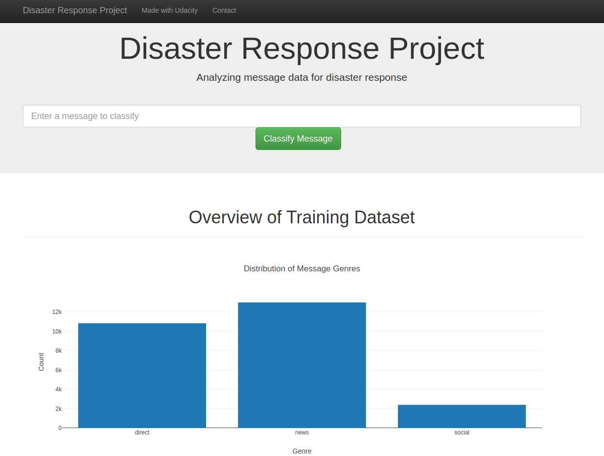
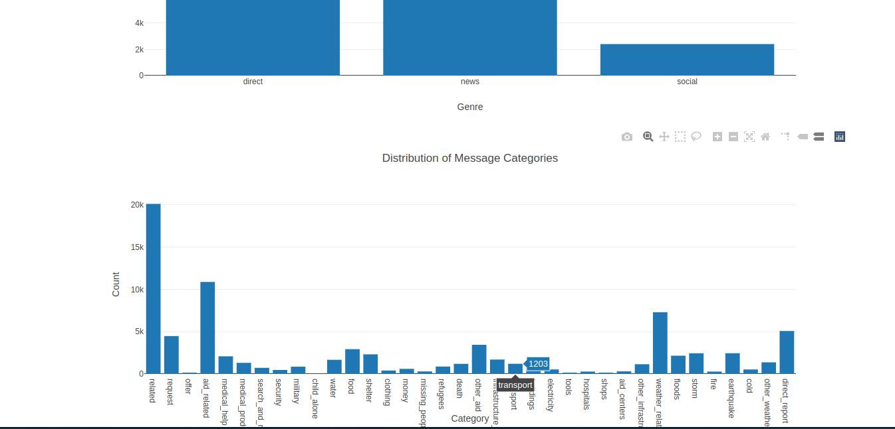
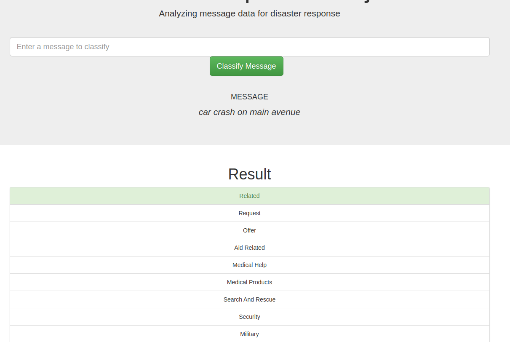

# Disaster Response Pipeline Project
### Project Overview ###

The project is part of the Udacity DataScience NanoDegree, Data Engineering section, in collaboration with Figure Eight.

For the development of the project, pre-labeled tweets were provided in order to build a ML model and WebApp that will
allow the classification of free text into given categories associated with disaster response, all of this online, so 
the messages can be routed to the correct response team.

### Libraries for the project ###

In the project, we are using the following libraries:
* sys
* SQLAlchemy
* Pandas
* NLTK
* RE
* Numpy
* SKLearn
* pickle
* JSON
* Plotly
* Flask

### Data Description ###

As source for training the model, we are using the dataset provided by Figure Eight:

* disaster_categories.csv: Categories of the messages
* disaster_messages.csv: Multilingual disaster response message

### Instructions:
1. Run the following commands in the project's root directory to set up your database and model.

    - To run ETL pipeline that cleans data and stores in database
        `python data/process_data.py data/disaster_messages.csv data/disaster_categories.csv data/DisasterResponse.db`
    - To run ML pipeline that trains classifier and saves
        `python models/train_classifier.py data/DisasterResponse.db models/classifier.pkl`

2. Run the following command in the app's directory to run your web app.
    `python run.py`

3. Go to http://0.0.0.0:3001/

### Results ### 
The outcome of the project can be seen on the following screenshots of the application:

Above image present the main screen to enter a message to be classified with a chart for Gender counts-

Next image present the secon chart that showcase the distribution of messages by category.

Finally, we have the result of the classification for a specific message:

### Note on Notebooks ###

The Jupyter Notebooks, in the Notebooks folder, that are included in the repository, the usage was for initial exploration and testing, the final 
work was performed on the .py files, the notebooks doesn't contain any usable code or warranties, they are here for archival (and sentimental) 
reason.

### Acknowledgements ###

Thanks to Udacity for the great material and Figure Eight for the dataset and context to develop this project.

### Further development ###

The usage of machine learning models trained on the classified data is a good initial approach, but in order to get 
**state-of-the-art** results, more advance techniques are to be used, most likely using Deep Learning with Transformers. 
With this method more accurate classification could be made. Also, the on-line improvement of the model by capturing 
user feedback is road to be explored in order to get more precise result. 
Finally, an important enhancement would be to deal with the unbalanced classed in order to have a better representation
of the data and have higher accuracy.